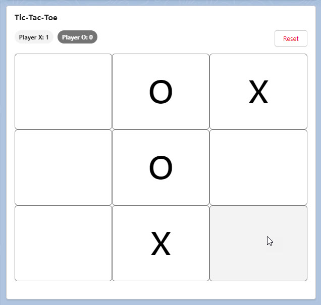

# Salesforce Tic-Tac-Toe

This is a Lightning Web Component that allows two local users to play Tic-Tac-Toe. Scores are tracked over multiple games.

## Installation

1. Clone the repository
2. In the project, authorize your org or create a new scratch org
3. Push project to the org
4. Add the custom component "tictactoe" to a Home or App page in Lightning App Builder
5. Save and navigate to that page to play
